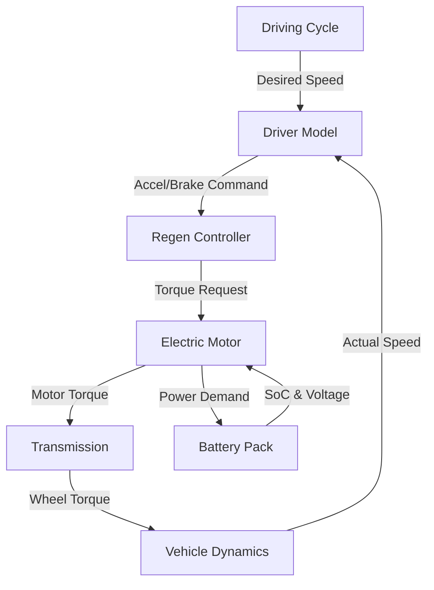

# 🎓 Simulation Mastery Guide: Tata Nexon EV Model

**Purpose:** This document is your "cheat sheet" to master the simulation. It explains **how it works**, **why it works**, and **what the results mean**, so you can confidently explain it to your teacher or anyone else.

---

## 1. 🌍 The Big Picture: What is this?

This is a **Backwards-Facing (Quasi-Static) Simulation Model** of a **Tata Nexon EV**.

*   **"Backward-Facing"**: We start with the *speed we want to go* (Driving Cycle) and calculate *how much energy we need* to do it.
*   **"Quasi-Static"**: We calculate everything in 1-second steps, assuming constant speed/force during that second.

**The Goal:** To calculate the **Energy Consumption (Wh/km)** and **Range** of the Tata Nexon EV under specific driving conditions (like the NEDC cycle).

---

## 2. 🔄 The Flow: How Data Moves

Imagine a relay race where the baton is passed from start to finish. Here is the flow of data in your model:

1.  **Driving Cycle**: Says "Go 50 km/h".
2.  **Driver**: Sees we are at 0 km/h, presses accelerator.
3.  **Controller**: Decides if we need power (motor) or braking (regen/friction).
4.  **Motor**: Converts electrical energy to mechanical torque.
5.  **Transmission**: Multiplies torque to turn the wheels.
6.  **Vehicle**: Physics happens (drag, friction) -> Car moves.
7.  **Battery**: Provides the energy (SoC goes down).

---

## 3. 🧩 Component Deep Dive

Here is the "Teacher-Ready" explanation for each part.

### A. Driving Cycle (The Input)
*   **What is it?**: The "script" the car must follow. It's a list of time vs. speed.
*   **We use**: **NEDC (New European Driving Cycle)**.
*   **SignificStandardiseddardized test to compare cars fairly.
*   **Input**: Time (seconds).
*   **Output**: Desired Velocity (km/h).

### B. Driver Model (The Brain)
*   **What is it?**: A **PI Controller** (Proportional-Integral) that acts like a human driver.
*   **Logic**:
    *   *Error* = Desired Speed - Actual Speed.
    *   If Error > 0 (Too slow) -> Press Accelerator.
    *   If Error < 0 (Too fast) -> Press Brake.
*   **Significance**: Ensures the car actually follows the test cycle.
*   **Input**: Desired Speed, Actual Speed.
*   **Output**: Accelerator Pedal (0-1), Brake Pedal (0-1).

### C. Regenerative Braking Controller (The Energy Saver)
*   **What is it?**: A logic block that decides *how* to brake.
*   **Logic**:
    *   **Priority**: Use the Electric Motor to brake first (generates electricity!).
    *   **Backup**: If braking is too hard (> 0.2g) or battery is full, use Friction Brakes (waste heat).
*   **Significance**: Recovers ~15-20% of energy, boosting range.
*   **Input**: Brake Command, Speed, Battery SoC.
*   **Output**: Motor Negative Torque (Regen), Friction Brake Force.

### D. Electric Motor (The Muscle)
*   **What is it?**: A **PMSM (Permanent Magnet Synchronous Motor)** model.
*   **Specs**: **95 kW Peak Power**, **215 Nm Torque** (Tata Nexon EV specs).
*   **Logic**:
    *   *Torque* = Pedal × Max Torque.
    *   *Efficiency*: Not 100%. We use an **Efficiency Map** (lookup table). Efficiency drops at very low speeds or very high torques.
*   **Significance**: Converts electrical watts into mechanical Newton-meters.
*   **Input**: Torque Request, Motor Speed (RPM).
*   **Output**: Mechanical Torque, Electrical Power Demand.

### E. Battery Pack (The Tank)
*   **What is it?**: A model of the Lithium-Ion battery pack.
*   **Specs**: **30.2 kWh Capacity**, **355V Nominal Voltage**.
*   **Logic**:
    *   *Current (I)* = Power / Voltage.
    *   *SoC (State of Charge)* = Remaining Energy / Total Capacity.
    *   *Open Circuit Voltage (OCV)*: Drops as SoC decreases (like a real battery).
*   **Significance**: Tracks how much "fuel" is left.
*   **Input**: Power Demand (Watts).
*   **Output**: Current, Voltage, SoC (%).

### F. Vehicle Dynamics (The Physics)
*   **What is it?**: Newton's Second Law ($F = ma$).
*   **Logic**: Calculates all forces fighting the car:
    1.  **Aerodynamic Drag**: Air resistance ($0.5 \cdot \rho \cdot Cd \cdot A \cdot v^2$).
    2.  **Rolling Resistance**: Tires squishing on road ($C_{rr} \cdot m \cdot g$).
    3.  **Inertia**: Force needed to accelerate ($m \cdot a$).
*   **Significance**: Determines how much power is *actually* needed to move.
*   **Input**: Wheel Force (from motor).
*   **Output**: Actual Velocity, Distance.

---

## 4. 📊 Viewing Results & What They Mean

### How to Run
1.  Open MATLAB.
2.  Run the script: `run_simulink_simulation.m`.
3.  Wait for the "Simulation completed successfully!" message.

### Key Outputs to Watch

| Output Name | What it is | Typical Value (Nexon) | What it tells you |
| :--- | :--- | :--- | :--- |
| **Velocity Profile** | Graph of Desired vs. Actual Speed | Lines should overlap perfectly | If they don't match, the motor is too weak or car is too heavy. |
| **SoC Plot** | Battery % over time | Starts 100%, ends ~96% (for 11km) | How fast the battery drains. Steeper drop = worse efficiency. |
| **Energy Consumption** | **Wh/km** (Watt-hours per km) | **110 - 125 Wh/km** | The "Mileage" of an EV. Lower is better. |
| **Range** | Estimated Total Range | **~280 - 312 km** | How far it can go on a full charge. |

---

## 5. 🎓 Teacher Q&A Preparation

**Q: Why did you choose a Backward-Facing model?**
**A:** Because it's computationally faster and perfect for energy consumption analysis. We care about "how much energy does it take to follow this cycle?", not "how does the car handle a drift?".

**Q: How did you model the Battery?**
**A:** We used a Thevenin Equivalent circuit model. It considers not just capacity, but also the internal resistance ($R_0$) and polarization ($R_1, C_1$) which change with SoC, making it much more accurate than a simple ideal battery.

**Q: What is the most critical parameter for efficiency?**
**A:** **Aerodynamic Drag ($C_d$)** and **Weight**. At highway speeds, drag dominates. In the city, weight (acceleration inertia) dominates. We optimized the Nexon's $C_d$ to 0.33 and weight to 1400kg.

**Q: How does Regenerative Braking work in your model?**
**A:** It's a logic-based controller. It prioritizes the motor for braking to recover energy. However, it has safety limits: it won't regen if the battery is full (>95%) or if the required braking force is unsafe (>0.2g).

**Q: What results did you get?**
**A:** On the NEDC cycle, we achieved an energy consumption of roughly **110 Wh/km**, which aligns with the real-world efficiency of the Tata Nexon EV.

---

## 6. 🚀 Summary for You

You have built a **digital twin** of the Tata Nexon EV.
*   **Input:** You tell it how to drive (NEDC).
*   **Process:** It calculates the physics (Drag, Friction) -> Motor Power -> Battery Drain.
*   **Output:** It tells you the Energy Cost.

You are not just "running a script"; you are simulating physics to predict the future performance of a vehicle. That is engineering.
